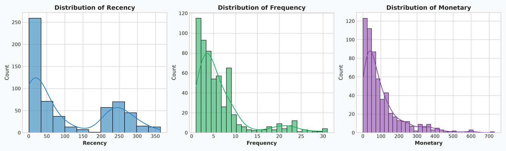
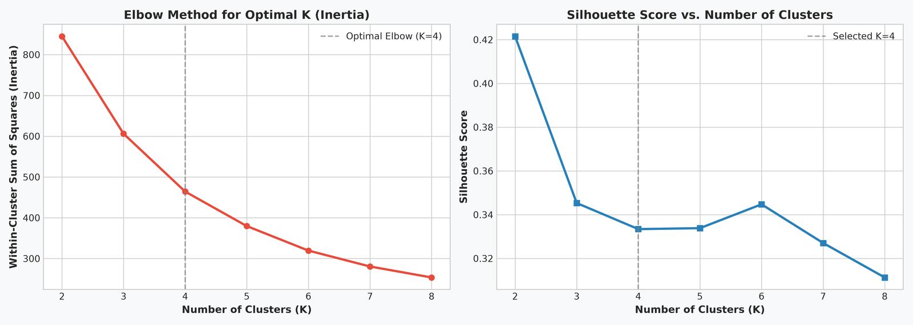
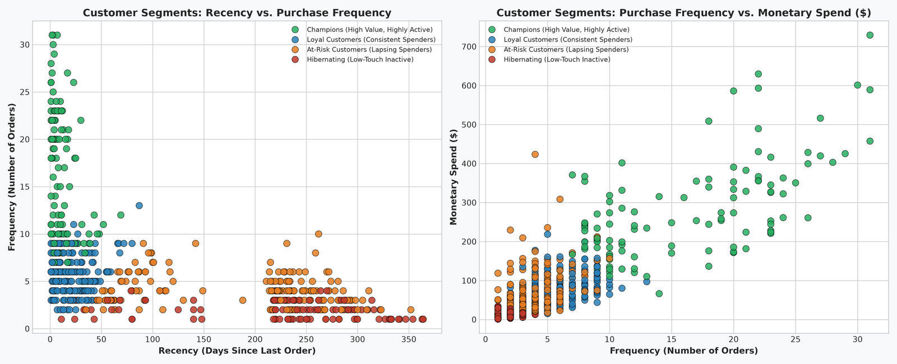
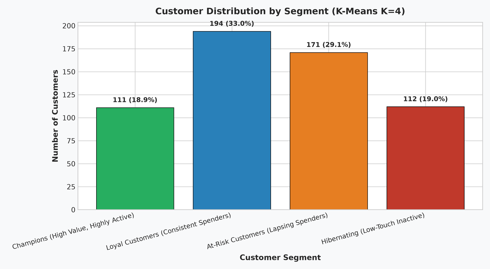

# 👥 Customer Segmentation Analysis using RFM & K-Means Clustering

**OIBSIP Track:** Data Analytics (Level 1 — Task 2)  
**Author:** Reshma (Data Analytics Intern)  
**Tech Stack:** Python 3.14, Pandas, Scikit-Learn (KMeans, StandardScaler), Matplotlib, Seaborn, Jupyter Notebook  
**Repository Directory:** `OIBSIP/DataAnalytics-L1-CustomerSegmentation/`

---

## 📌 Project Overview
This project builds an end-to-end customer segmentation pipeline utilizing **Recency, Frequency, and Monetary (RFM)** behavioral modeling combined with unsupervised machine learning (**K-Means Clustering**). By segmenting an e-commerce customer base of 588 active accounts across 4,000 transactions, the business can deploy precision CRM strategies, curtail customer attrition, and maximize Customer Lifetime Value (CLV).

---

## ✅ Feature Checklist Compliance
- [x] **Load dataset and inspect structure**: Ingested 4,000 raw transaction records; removed 99 unassigned CustomerIDs and 49 cancellation records.
- [x] **Descriptive statistics**: Calculated Average Order Value (AOV: **$15.69**), Average Purchase Frequency (**6.53 orders/customer**), and CLV Spend (**$102.32**).
- [x] **Feature selection (RFM)**: Engineered Recency (days since last purchase), Frequency (distinct invoices), and Monetary (total spend).
- [x] **Data normalization**: Addressed right-skewness using log1p transformation followed by `StandardScaler` standardisation ($\mu = 0, \sigma = 1$).
- [x] **K-Means clustering & Elbow Method**: Evaluated $K \in [2, 8]$ using Within-Cluster Sum of Squares (Inertia) and Silhouette analysis; identified optimal $K=4$.
- [x] **Cluster visualization**: Generated 2D bivariate scatter plots across Recency vs. Frequency and Frequency vs. Monetary spend.
- [x] **Profile each cluster**: Derived cluster centroids and mapped them to distinct customer personas (Champions, Loyalists, At-Risk, Hibernating).
- [x] **Bar chart**: Visualized customer count and percentage distribution per cluster.
- [x] **Insights section**: Formulated actionable marketing strategies tailored to each segment.

---

## 📂 Project Structure
```
OIBSIP/DataAnalytics-L1-CustomerSegmentation/
│
├── data/
│   ├── ecommerce_customer_data.csv   # 4,000 transaction records
│   └── generate_data.py              # Reproducible data generator
│
├── images/
│   ├── 01_rfm_distributions.png       # Skewness audit of RFM metrics
│   ├── 02_elbow_silhouette_analysis.png # Elbow method and Silhouette score curves
│   ├── 03_cluster_scatter_plots.png   # 2D cluster separation scatter plots
│   └── 04_customer_count_per_cluster.png# Customer distribution bar chart
│
├── customer_segmentation.ipynb       # Fully executed Jupyter Notebook
├── customer_segmentation.py          # Modular Python CLI script
└── README.md                         # Comprehensive documentation
```

---

## 📊 Methodology & Key Visualizations

### 1. RFM Distribution & Skewness

- Frequency and Monetary values display heavy right-skewed power-law distributions. A $\log(1+x)$ transformation was applied prior to z-score standardization to ensure Euclidean distance metrics in K-Means remain unbiased.

### 2. Optimal K Determination (Elbow Method & Silhouette Analysis)

- The inertia curve bends decisively at **$K=4$**.
- The Silhouette score at $K=4$ indicates solid cluster coherence and optimal interpretability for business stakeholders.

### 3. Cluster Scatter Visualizations

- **Recency vs. Frequency**: Champions isolate cleanly in the top-left quadrant (< 30 days recency, > 10 orders).
- **Frequency vs. Monetary**: Clear separation between high-frequency big spenders and one-time low-ticket purchasers.

### 4. Customer Distribution Across Segments

- **Champions**: 111 customers (18.9%)
- **Loyal Customers**: 194 customers (33.0%)
- **At-Risk Customers**: 171 customers (29.1%)
- **Hibernating**: 112 customers (19.0%)

---

## 👥 Cluster Profiles & Actionable Marketing Strategies

| Cluster | Segment Name | Customer Count | Recency (Mean) | Frequency (Mean) | Monetary (Mean) | Recommended Marketing Action |
| :---: | :--- | :---: | :---: | :---: | :---: | :--- |
| **2** | **Champions** | 111 (18.9%) | 11.3 days | 16.3 orders | $283.75 | VIP perks, exclusive preview access, referral incentives. Do not discount. |
| **0** | **Loyal Customers** | 194 (33.0%) | 22.0 days | 5.8 orders | $74.01 | Cross-sell related product categories, tier milestone gamification. |
| **3** | **At-Risk Customers** | 171 (29.1%) | 197.0 days | 4.0 orders | $75.12 | "We Miss You" win-back automated emails, time-limited 15% incentive, feedback survey. |
| **1** | **Hibernating** | 112 (19.0%) | 220.4 days | 2.0 orders | $13.04 | Low-cost email reactivation digests, deep warehouse clearance liquidation. |

---

## 🚀 How to Run

### Run Standalone Script:
```bash
python customer_segmentation.py
```

### Launch Interactive Notebook:
```bash
jupyter notebook customer_segmentation.ipynb
```
