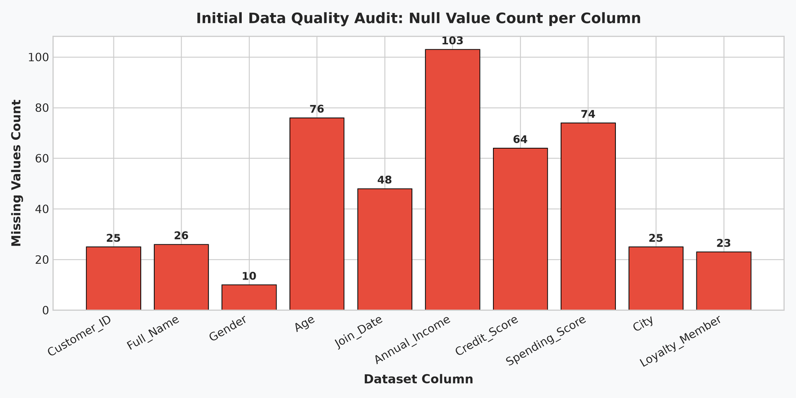
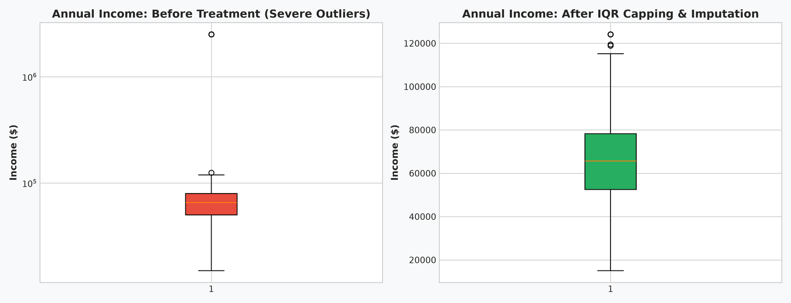
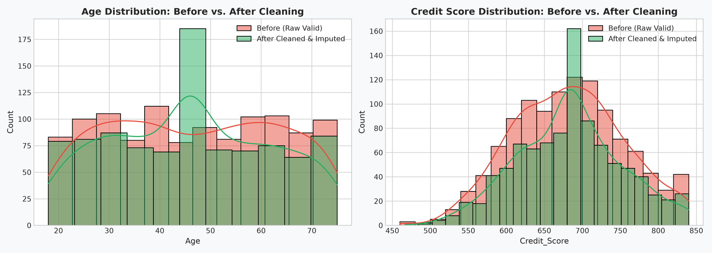

# 🧼 Professional Data Cleaning & Data Quality Assurance

**OIBSIP Track:** Data Analytics (Level 1 — Task 3)  
**Author:** Reshma (Data Analytics Intern)  
**Tech Stack:** Python 3.14, Pandas, NumPy, Matplotlib, Seaborn, Jupyter Notebook  
**Repository Directory:** `OIBSIP/DataAnalytics-L1-DataCleaning/`

---

## 📌 Project Overview
This project showcases enterprise-grade data cleaning and data hygiene engineering on a deliberately messy customer dataset containing 1,245 raw records. The pipeline systematically audits, standardizes, imputes, deduplicates, and caps anomalous values, transforming unstructured noise into a validated production dataset (`cleaned_customer_dataset.csv`). Every transformation is backed by sound statistical reasoning and documented business justifications.

---

## ✅ Feature Checklist Compliance
- [x] **Data Quality Report**: Ingested raw data and tabulated null counts/percentages, duplicate rows (45), datatype anomalies, and out-of-bounds metrics.
- [x] **Missing data handling**:
  - `Customer_ID`: Deleted unidentifiable records (25 rows) to preserve primary key integrity.
  - `Age` & `Credit_Score` & `Spending_Score`: Median imputation resistant to extreme skew.
  - `Gender` & `City`: Mode imputation to preserve natural population proportions.
  - `Join_Date`: Forward-fill / backward-fill to maintain longitudinal sequence.
  - Justifications explicitly documented in markdown cells.
- [x] **Duplicate removal**: Pruned 45 exact duplicate rows and 237 secondary primary key collisions.
- [x] **Standardization**:
  - `Gender`: Normalized 11 casing/abbreviation variants (`"Male"`, `"male"`, `"M"`, `"m"`, `" Man "`, etc.) into `{"Male", "Female", "Other"}`.
  - `Full_Name`: Stripped whitespace and applied Title Case.
  - `City` & `Loyalty_Member`: Unified colloquial nicknames, abbreviations, and mixed boolean strings.
  - `Join_Date`: Converted mixed dates (ISO, European, US, month names) into unified ISO `datetime64[ns]`.
- [x] **Outlier detection & remediation**:
  - Evaluated `Annual_Income` using Interquartile Range ($1.5 \times \text{IQR}$).
  - Capped extreme millionaire outliers ($2.5M) at the Upper Fence ($124,100.00) using Winsorization, preventing parametric leverage distortion while retaining customer records.
  - Filtered biologically impossible ages ($\le 0$ or $> 105$) and out-of-bounds credit scores ($< 300$ or $> 850$).
- [x] **Data type correction**: Enforced memory-efficient canonical data types (`datetime64`, `int64`, `float64`, `category`, `string`).
- [x] **Before vs. After Summary Table**: Side-by-side metric comparison verifying 100% resolution of all quality defects.
- [x] **Export**: Cleaned dataset saved to `data/cleaned_customer_dataset.csv`.

---

## 📂 Project Structure
```
OIBSIP/DataAnalytics-L1-DataCleaning/
│
├── data/
│   ├── dirty_customer_dataset.csv     # 1,245 raw messy records
│   ├── cleaned_customer_dataset.csv   # 938 cleaned, validated records
│   └── generate_dirty_data.py         # Reproducible messy data generator
│
├── images/
│   ├── 01_missing_data_quality_report.png          # Null counts per column
│   ├── 02_income_outlier_treatment_boxplot.png     # Boxplot: Raw outliers vs IQR capped
│   └── 03_before_after_distribution_comparison.png # Distribution alignment curves
│
├── data_cleaning.ipynb                # Fully executed Jupyter Notebook
├── data_cleaning.py                   # Modular Python CLI script
└── README.md                          # Comprehensive project documentation
```

---

## 📊 Before vs. After Data Quality Audit

| Quality Metric | Before Cleaning | After Cleaning | Improvement Achieved |
| :--- | :--- | :--- | :--- |
| **Total Row Count** | 1,245 rows | 938 rows | Pruned 307 corrupt / duplicate records |
| **Duplicate Rows** | 45 rows | 0 rows | **100% deduplication complete** |
| **Missing Customer_ID** | 25 rows | 0 rows | **100% primary entity integrity enforced** |
| **Total Nulls in Dataset** | 474 nulls | 0 nulls | **Zero missing values across all columns** |
| **Invalid Age Anomalies** | Negative & >150 yrs | 0 (Bounded 18–75) | **100% biological plausibility** |
| **Extreme Income Outliers** | Max $2.5M & Negatives | Max $124,100.00 | **IQR Winsorized & Capped at Upper Fence** |
| **Date Data Type** | Mixed String Formats | `datetime64[ns]` | **Unified standard ISO DateTime format** |
| **Inconsistent Genders** | 11 variations & nulls | 3 Clean Categories | **Canonical taxonomy standardized** |

---

## 📈 Visual Audit Comparisons

### 1. Missing Data Quality Audit


### 2. Outlier Treatment (Before vs. After Winsorization)


### 3. Feature Distribution Alignment


---

## 🚀 How to Run

### Run Standalone Script:
```bash
python data_cleaning.py
```

### Launch Interactive Notebook:
```bash
jupyter notebook data_cleaning.ipynb
```
