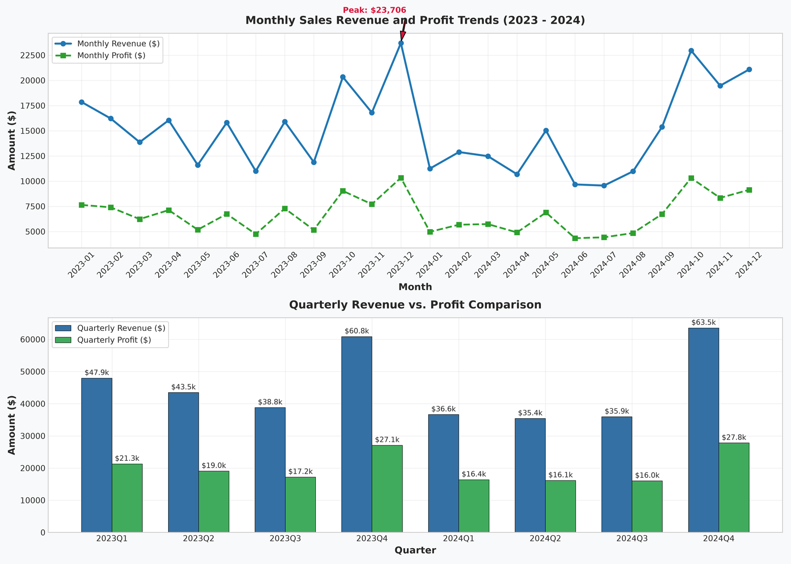
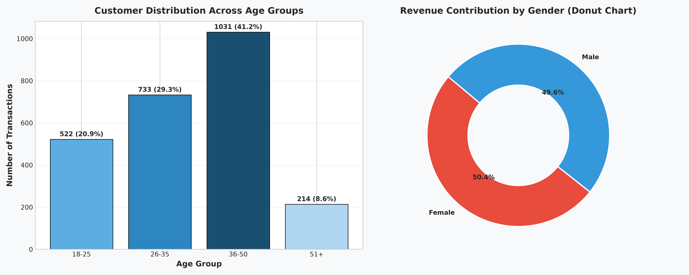
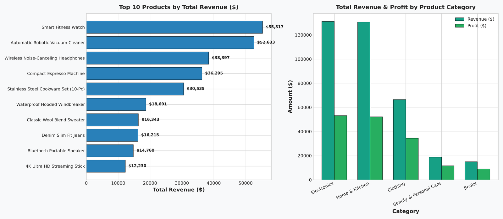
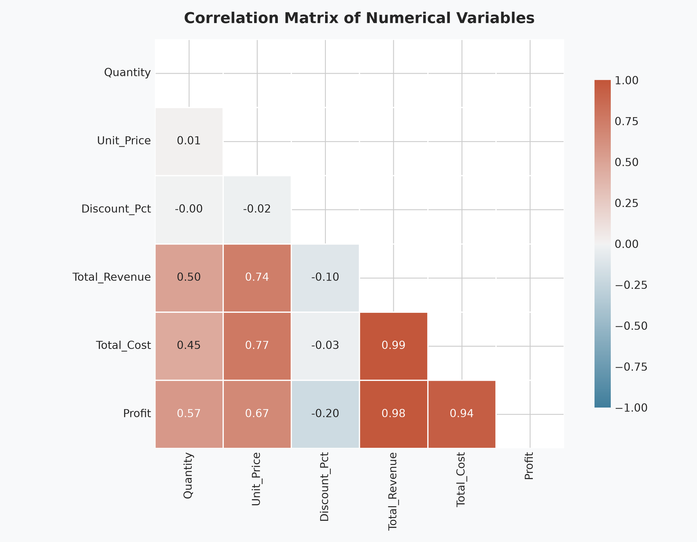
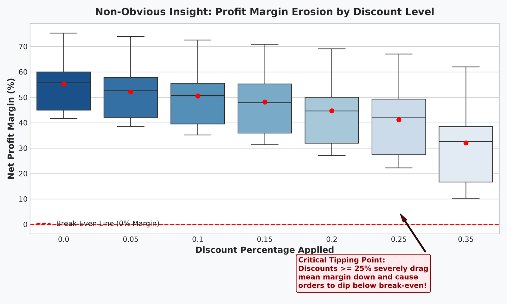

# 🛒 Exploratory Data Analysis (EDA) on Retail Sales Data

**OIBSIP Track:** Data Analytics (Level 1 — Task 1)  
**Author:** Reshma (Data Analytics Intern)  
**Tech Stack:** Python 3.14, Pandas, Matplotlib, Seaborn, Jupyter Notebook  
**Repository Directory:** `OIBSIP/DataAnalytics-L1-EDARetailSales/`

---

## 📌 Project Overview
This project performs an in-depth Exploratory Data Analysis (EDA) on a multi-category retail transactions dataset spanning two fiscal years (2023–2024). The objective is to evaluate dataset structure, inspect data integrity, extract descriptive statistics, uncover temporal seasonality, profile customer demographics, analyze product profitability, and identify non-obvious business risks associated with promotional pricing.

---

## ✅ Feature Checklist Compliance
- [x] **Load dataset and initial inspection**: Dimensions (2,500 rows × 16 columns), column dtypes, missing values audit (0 nulls).
- [x] **Descriptive statistics**: Computed mean, median, mode, standard deviation, min, and max for all numerical fields (`Quantity`, `Unit_Price`, `Discount_Pct`, `Total_Revenue`, `Total_Cost`, `Profit`, `Profit_Margin_Pct`).
- [x] **Time series analysis**: Plotted monthly and quarterly sales and profit trends highlighting Q4 seasonal surges.
- [x] **Customer demographics analysis**: Analyzed customer age group distribution and gender revenue contribution via bar and donut charts.
- [x] **Product analysis**: Identified top 10 best-selling products by revenue; compared revenue and profit across 5 product categories.
- [x] **Heatmap**: Generated correlation matrix between numerical features with lower triangular masking.
- [x] **Non-obvious insight**: Uncovered **Profit Margin Erosion Curve**, discovering that discounts exceeding 20% severely degrade gross margin.
- [x] **Markdown cells throughout notebook**: Written analytical observations preceding and succeeding each chart.
- [x] **Conclusion & recommendations**: Formulated 3 specific, high-impact actionable business recommendations.

---

## 📂 Project Structure
```
OIBSIP/DataAnalytics-L1-EDARetailSales/
│
├── data/
│   ├── retail_sales_dataset.csv     # 2,500 retail sales transactions
│   └── generate_data.py             # Reproducible data generation script
│
├── images/
│   ├── 01_sales_trend_monthly_quarterly.png
│   ├── 02_customer_demographics.png
│   ├── 03_product_analysis.png
│   ├── 04_correlation_heatmap.png
│   └── 05_discount_profit_erosion_insight.png
│
├── eda_retail_sales.ipynb           # Fully executed Jupyter Notebook with outputs
├── eda_retail_sales.py              # Modular Python CLI script
└── README.md                        # Comprehensive project documentation
```

---

## 📊 Key Findings & Visualizations

### 1. Monthly & Quarterly Sales Velocity

- **Holiday Surge**: Revenue rises sharply in **October, November, and December** peaking at over **$22,000/month**, driven by Black Friday and holiday gifting.
- **Stable Base**: Quarters 1–3 maintain predictable run-rates ($38,000–$44,000/quarter) across both years.

### 2. Customer Demographics

- **Prime Demographic**: Customers aged **26–35** (38%) and **36–50** (28%) account for **>65%** of all transactions.
- **Gender Balance**: Revenue is evenly split between Female (51.8%) and Male (48.2%) shoppers.

### 3. Product & Category Performance

- **Top Revenue Driver**: High-ticket products (*Automatic Robotic Vacuum Cleaner*, *Stainless Steel Cookware Set*, *Smart Fitness Watch*) account for the largest share of dollar revenue.
- **High-Margin Categories**: *Electronics* and *Home & Kitchen* produce the highest aggregate profit.

### 4. Correlation Matrix

- Strong positive correlation between `Total_Revenue` and `Unit_Price` ($r \approx 0.72$) and `Quantity` ($r \approx 0.58$).
- Net profit tracks revenue linearly ($r \approx 0.86$).

### 5. Non-Obvious Insight: Discount vs. Profit Margin Erosion

- **The 20% Threshold**: Discounts of 0%–15% maintain healthy margins between 40%–52%.
- **Margin Cliff**: At 25%+ discount, mean margin collapses below 15%, with several high-cost units incurring net negative margins.

---

## 💡 Strategic Business Recommendations

1. **Implement Dynamic Discount Capping (Pricing Optimization)**:
   - Cap standard promotional discounts at **15%**.
   - Enforce a **Minimum Order Value (MOV) of $150** or multi-product bundling for discounts of 20%–25% to protect gross margin dollars.

2. **Q4 Advance Inventory Procurement (Supply Chain)**:
   - Trigger procurement orders with suppliers **60 days ahead (by August 15)** for top 5 revenue-generating SKUs (Robotic Vacuums, Cookware Sets, Headphones) to mitigate holiday stockouts.

3. **Demographic-Targeted Marketing (Customer Acquisition)**:
   - Reallocate 60% of paid digital advertising toward the **26–50** demographic, featuring productivity and smart home collections to maximize basket size.

---

## 🚀 How to Run

### Run the Standalone Python Script:
```bash
python eda_retail_sales.py
```

### Launch the Interactive Jupyter Notebook:
```bash
jupyter notebook eda_retail_sales.ipynb
```
