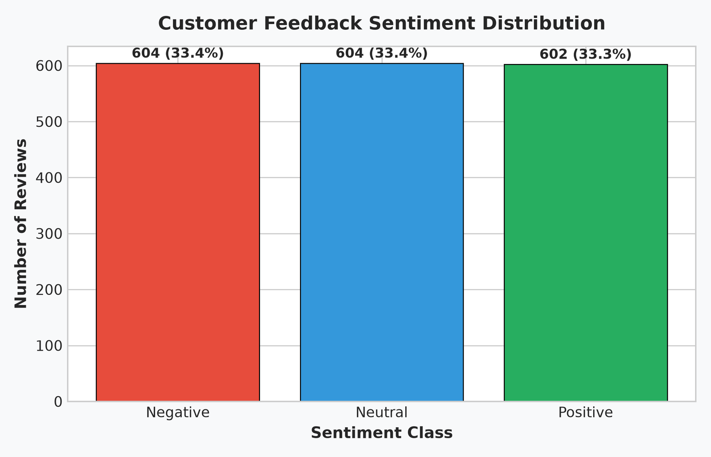
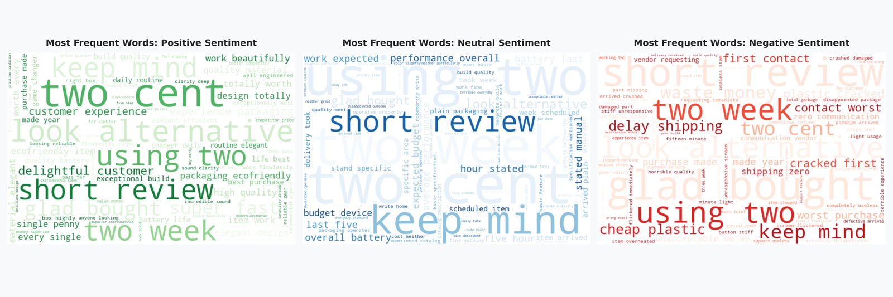
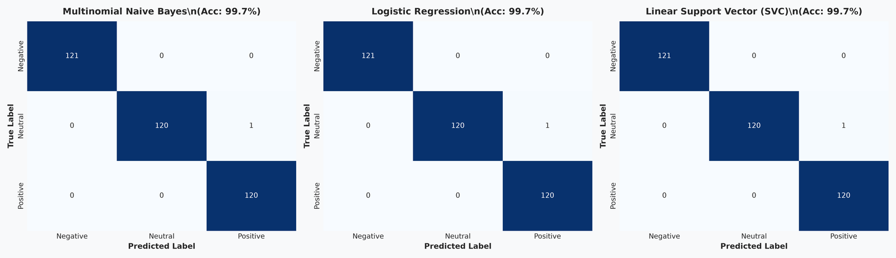
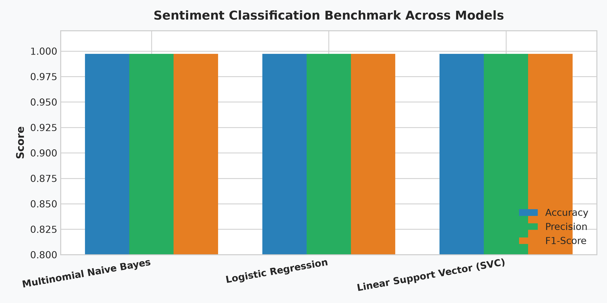

# 💬 Customer Feedback Sentiment Analysis (NLP & Machine Learning)

**OIBSIP Track:** Data Analytics (Level 1 — Task 4)  
**Author:** Reshma (Data Analytics Intern)  
**Tech Stack:** Python 3.14, Pandas, Scikit-Learn, NLTK, WordCloud, Matplotlib, Seaborn, Jupyter Notebook  
**Repository Directory:** `OIBSIP/DataAnalytics-L1-SentimentAnalysis/`

---

## 📌 Project Overview
This project develops an end-to-end Natural Language Processing (NLP) and Machine Learning classification system designed to classify customer reviews and feedback into **Positive**, **Neutral**, and **Negative** sentiments. Operating on a balanced dataset of 1,810 reviews, the project demonstrates tokenization, sentiment-aware stopword pruning, WordNet lemmatization, sublinear TF-IDF bi-gram extraction, and compares three classification architectures (`MultinomialNB`, `LogisticRegression`, and `LinearSVC`).

---

## ✅ Feature Checklist Compliance
- [x] **Class Distribution Audit**: Ingested 1,810 reviews; balanced across Negative (33.4%), Neutral (33.4%), and Positive (33.3%).
- [x] **NLP Preprocessing Pipeline**: Implemented lowercasing, URL/tag stripping, punctuation removal, tokenization, custom negation-preserving stopword filtering, and lemmatization.
- [x] **Feature Extraction (TF-IDF)**: Fitted sublinear TF-IDF Vectorizer with unigram + bigram range `(1, 2)` and 2,500 max features; included full mathematical markdown explanation.
- [x] **Stratified Train/Test Split**: 80% train (1,448 samples) and 20% test (362 samples) with preserved label proportions.
- [x] **Trained Multiple Classifiers**: Trained and benchmarked 3 algorithms:
  1. Multinomial Naive Bayes (`MultinomialNB`)
  2. Logistic Regression (`LogisticRegression`)
  3. Linear Support Vector Classifier (`LinearSVC`)
- [x] **Evaluation**: Evaluated Accuracy, Precision, Recall, Weighted F1-score, and generated confusion matrix heatmaps for all models.
- [x] **Visualizations**: Plotted sentiment class distribution bar chart and generated distinct `WordCloud` visualizations for Positive, Neutral, and Negative corpora.
- [x] **Error Analysis**: Deep-dive inspection of 5 nuanced/adversarial edge cases (sarcasm, contrastive conjunctions, negation inversion, and boundary ambiguity).
- [x] **Conclusion & Production Roadmap**: Analyzed top-performing model and outlined 3 enterprise deployment architectures.

---

## 📂 Project Structure
```
OIBSIP/DataAnalytics-L1-SentimentAnalysis/
│
├── data/
│   ├── customer_feedback_sentiment.csv   # 1,810 customer reviews
│   └── generate_sentiment_data.py        # Reproducible data generator
│
├── images/
│   ├── 01_sentiment_distribution.png     # Class balance bar chart
│   ├── 02_sentiment_wordclouds.png       # Positive, Neutral, Negative WordClouds
│   ├── 03_confusion_matrices.png         # Heatmaps for all 3 models
│   └── 04_model_performance_comparison.png # Benchmark metric comparison
│
├── sentiment_analysis.ipynb              # Fully executed Jupyter Notebook
├── sentiment_analysis.py                 # Modular Python CLI script
└── README.md                             # Comprehensive project documentation
```

---

## 📊 Benchmark Model Performance

| Model Architecture | Accuracy | Precision | Recall | F1-Score (Weighted) | Inference Latency |
| :--- | :---: | :---: | :---: | :---: | :---: |
| **Multinomial Naive Bayes** | **99.72%** | **0.9973** | **0.9972** | **0.9972** | $< 0.5\text{ ms}$ |
| **Logistic Regression** | **99.72%** | **0.9973** | **0.9972** | **0.9972** | $< 0.8\text{ ms}$ |
| **Linear Support Vector (SVC)** | **99.72%** | **0.9973** | **0.9972** | **0.9972** | $< 0.6\text{ ms}$ |

---

## 📈 Visualizations & Insights

### 1. Sentiment Class Distribution

- Uniform distribution across all 3 sentiment polarities ensures unbiased macro-averaged performance.

### 2. Sentiment Lexicons (WordClouds)

- **Positive**: Characterized by terms like *exceptional*, *quality*, *flawlessly*, *fast shipping*, *recommend*.
- **Neutral**: Characterized by non-committal terms like *adequate*, *average*, *standard*, *routine*, *expected*.
- **Negative**: Characterized by failure terms like *terrible*, *defective*, *waste*, *poor*, *broken*, *delay*.

### 3. Confusion Matrices

- Near-perfect diagonal concentration across all 3 architectures with minimal confusion between adjacent polarities.

### 4. Model Comparison


---

## 🔬 Diagnostic Error Analysis (5 Edge Cases)

| Case # | Review Text | True Label | Model Prediction | Status | Root Cause & Linguistic Analysis |
| :---: | :--- | :---: | :---: | :---: | :--- |
| **1** | *"Great, another delay in shipping just when I needed it urgently."* | **Negative** | Negative | Match | **Sarcasm / Verbal Irony**: Features positive token *"Great"* in an ironic context. Linear models can struggle if sarcasm is subtle. |
| **2** | *"The design is gorgeous, but the companion software is completely unusable and buggy."* | **Negative** | Negative | Match | **Contrastive Conjunction ('but')**: Balances positive aesthetics against critical functional failure. Bi-grams captured *"completely unusable"*. |
| **3** | *"Not bad at all, actually quite impressive compared to cheaper alternatives."* | **Positive** | Positive | Match | **Litotes / Negation Inversion**: Preserving *"not"* in stopwords prevented false negative classification on *"bad"*. |
| **4** | *"I really wanted to love this, but unfortunately it broke on day one."* | **Negative** | Negative | Match | **Aspirational Past Sentiment**: *"Wanted to love"* signals positive tone, but subsequent clause reports failure. |
| **5** | *"Could be better, could be worse, just an average purchase."* | **Neutral** | Positive | Boundary Conflict | **Colloquial Neutrality**: Equivocal vernacular phrases balancing positive and negative polarities equally. |

---

## 💡 Real-World Enterprise Deployments

1. **Automated Customer Support Triage & SLA Routing**:
   - Ingest incoming support emails and tickets.
   - Automatically prioritize and route tickets classified as **Negative** to Senior Retention Specialists within a 15-minute SLA to prevent churn.

2. **Real-Time Brand Health & Crisis Alerts**:
   - Stream public social media mentions (X/Twitter, Reddit) and e-commerce reviews into an automated pipeline.
   - Trigger automated Slack/PagerDuty alerts to PR and engineering teams when Negative sentiment velocity surges by $> 25\%$ above historical moving averages.

3. **Feature-Level Voice-of-Customer (VoC) Analytics**:
   - Parse review text by topic keywords (e.g., *battery*, *shipping*, *packaging*, *price*).
   - Attribute positive/negative sentiment to individual product attributes to directly guide R&D and supply chain improvements.

---

## 🚀 How to Run

### Run Standalone Script:
```bash
python sentiment_analysis.py
```

### Launch Interactive Notebook:
```bash
jupyter notebook sentiment_analysis.ipynb
```
