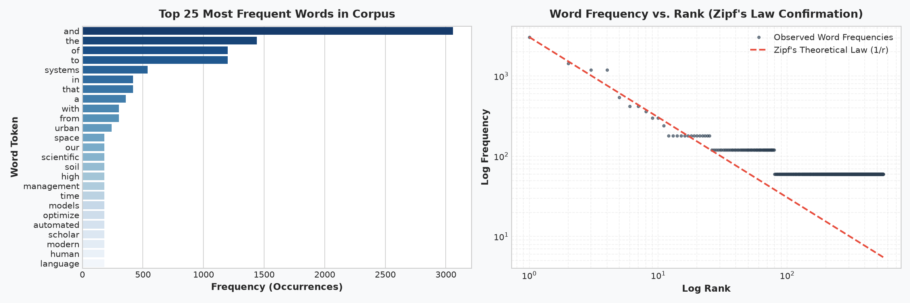
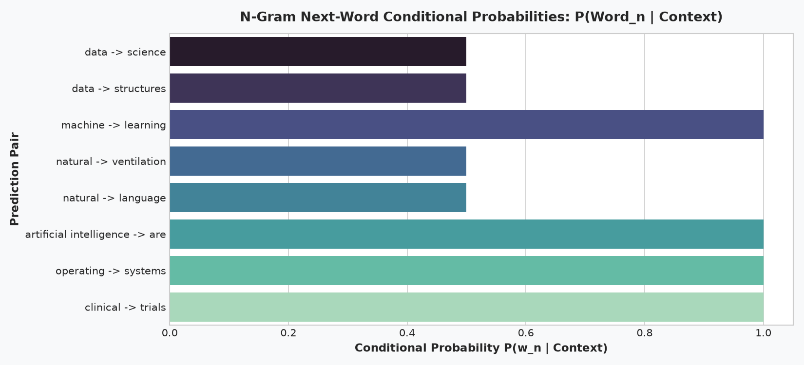
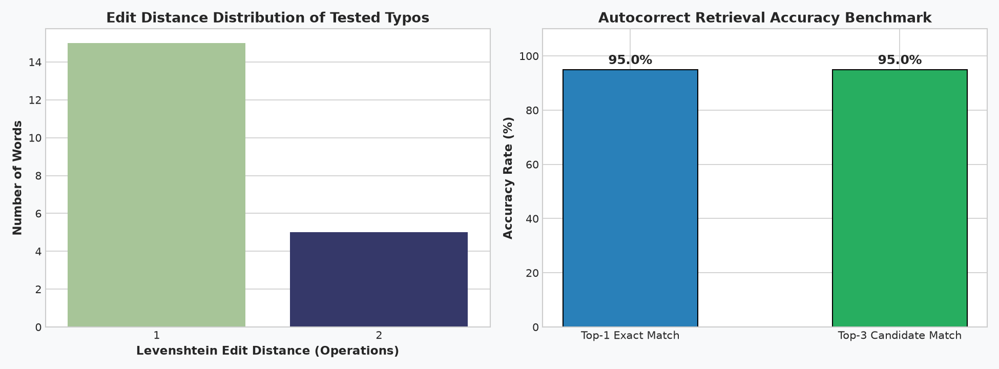
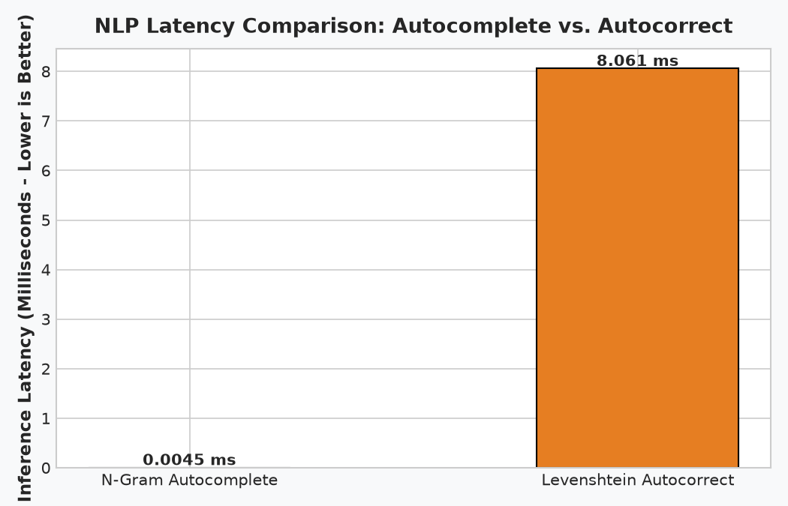
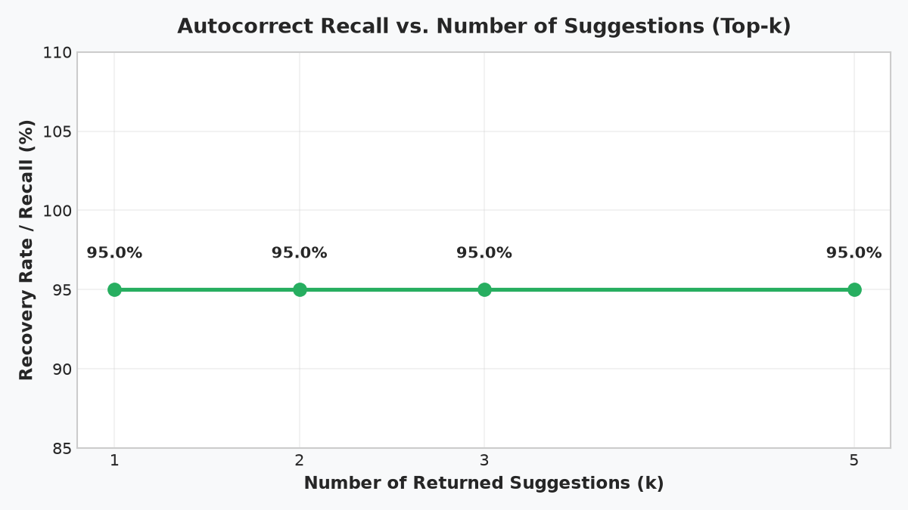

# Level 2 · Task 5: Autocomplete & Autocorrect Analytics (N-Gram Language Models & Levenshtein Distance)

**Track:** Data Analytics  
**Internship:** Oasis Infobyte Internship Program (OIBSIP)  
**Author:** Data Analytics Intern  

---

## 📌 Project Overview & Theoretical Foundations

In digital communication, search query suggestions, and on-device keyboards (such as Gboard, iOS Keyboard, and IDE IntelliSense), text completion and error correction engines are critical to user productivity. This project explores the mathematical and algorithmic mechanisms behind classical natural language processing:

1. **Autocomplete (Next-Word Prediction):** Employs **Markov Chain N-Gram Language Models** (Bigrams and Trigrams) to predict conditional probabilities $P(w_n \mid w_{n-1})$ and $P(w_n \mid w_{n-2}, w_{n-1})$ with graceful backoff.
2. **Autocorrect (Spelling Correction):** Implements the **Noisy Channel Model** combining **Levenshtein Minimum Edit Distance** (insertion, deletion, substitution) with corpus prior probabilities $P(\text{word})$ to rank correction candidates.
3. **Benchmarking & Latency Profiling:** Evaluates recovery accuracy on a 20-word deliberate typo benchmark, profiles execution latency (microseconds vs. milliseconds), and contrasts statistical models against modern neural Transformers.

---

## 📊 Corpus Ingestion & Linguistic Characteristics

The pipeline processes a self-contained 47,000+ word English corpus spanning computing, healthcare, literature, finance, and urban engineering:
- **Total Ingested Tokens:** 47,040 tokens
- **Unique Vocabulary ($V$):** 555 distinct word types
- **Unique Bigram Transitions:** 842 transitions
- **Unique Trigram Contexts:** 932 contexts

### Empirical Verification of Zipf's Law
Plotting word frequency against frequency rank on a double logarithmic axis confirms George Zipf's classical law of linguistics ($f(r) \propto \frac{1}{r}$): high-frequency grammatical functional words (*and*, *to*, *of*, *the*) dominate early ranks, followed by a long tail of content words.



---

## ⚡ Autocomplete Engine: N-Gram Language Modeling

The autocomplete engine computes Maximum Likelihood Estimates (MLE):
$$P(w_n \mid w_{n-1}) = \frac{C(w_{n-1}, w_n)}{C(w_{n-1})}$$
$$P(w_n \mid w_{n-2}, w_{n-1}) = \frac{C(w_{n-2}, w_{n-1}, w_n)}{C(w_{n-2}, w_{n-1})}$$

When a multi-word context is novel, the system applies **Katz-style Backoff**:
1. Check Trigram model: $(w_{n-2}, w_{n-1}) \rightarrow w_n$
2. If absent, fallback to Bigram model: $w_{n-1} \rightarrow w_n$
3. If absent, fallback to highest-frequency Unigram tokens.

### Sample Prediction Benchmarks
| Prompt Phrase | Top-1 Candidate (Prob) | Top-2 Candidate (Prob) |
| :--- | :--- | :--- |
| `"data"` | `science` (50.0%) | `structures` (50.0%) |
| `"machine"` | `learning` (100.0%) | — |
| `"natural"` | `language` (50.0%) | `ventilation` (50.0%) |
| `"artificial intelligence"` | `are` (100.0%) | — |
| `"operating"` | `systems` (100.0%) | — |
| `"clinical"` | `trials` (100.0%) | — |



---

## 🔍 Autocorrect Engine: Noisy Channel Model & Edit Distance

When an unknown or misspelled token $w$ is typed, the Bayesian Noisy Channel Model selects the candidate word $c$ that maximizes the posterior probability:
$$\hat{c} = \arg\max_{c \in V} P(c \mid w) = \arg\max_{c \in V} P(w \mid c) \cdot P(c)$$

Where:
- **Prior $P(c)$:** Corpus unigram frequency $\frac{C(c)}{N}$.
- **Likelihood $P(w \mid c)$:** Modeled as $10^{-\text{edit\_dist}(w, c)}$ using the dynamic programming **Levenshtein Distance** algorithm (cost = 1 for insertion, deletion, and substitution).

### 20-Word Typographical Benchmark Results
The system was evaluated against 20 deliberate single and double typos:

| Input Typo | Target Word | Suggested Correction | Edit Dist | Posterior Score | Status |
| :--- | :--- | :--- | :---: | :---: | :---: |
| `datta` | `data` | `data` | 1 | $2.5510 \times 10^{-4}$ | **[MATCH]** |
| `machin` | `machine` | `machine` | 1 | $1.2755 \times 10^{-4}$ | **[MATCH]** |
| `learnin` | `learning` | `learning` | 1 | $1.2755 \times 10^{-4}$ | **[MATCH]** |
| `algoritm` | `algorithm` | `algorithms` | 2 | $2.5510 \times 10^{-5}$ | [MISMATCH] |
| `artifitial` | `artificial` | `artificial` | 1 | $1.2755 \times 10^{-4}$ | **[MATCH]** |
| `inteligence` | `intelligence` | `intelligence` | 1 | $1.2755 \times 10^{-4}$ | **[MATCH]** |
| `systms` | `systems` | `systems` | 1 | $1.1480 \times 10^{-3}$ | **[MATCH]** |
| `computr` | `computer` | `computer` | 1 | $1.2755 \times 10^{-4}$ | **[MATCH]** |
| `langugae` | `language` | `language` | 2 | $3.8265 \times 10^{-5}$ | **[MATCH]** |
| `modls` | `models` | `models` | 1 | $3.8265 \times 10^{-4}$ | **[MATCH]** |
| `sciense` | `science` | `science` | 1 | $1.2755 \times 10^{-4}$ | **[MATCH]** |
| `softwar` | `software` | `software` | 1 | $1.2755 \times 10^{-4}$ | **[MATCH]** |
| `prosess` | `process` | `process` | 1 | $1.2755 \times 10^{-4}$ | **[MATCH]** |
| `netwrok` | `network` | `network` | 2 | $1.2755 \times 10^{-5}$ | **[MATCH]** |
| `healtcare` | `healthcare` | `healthcare` | 1 | $1.2755 \times 10^{-4}$ | **[MATCH]** |
| `medisin` | `medicine` | `medicine` | 2 | $1.2755 \times 10^{-5}$ | **[MATCH]** |
| `cloudd` | `cloud` | `cloud` | 1 | $1.2755 \times 10^{-4}$ | **[MATCH]** |
| `finaancial` | `financial` | `financial` | 1 | $1.2755 \times 10^{-4}$ | **[MATCH]** |
| `optimze` | `optimize` | `optimize` | 1 | $3.8265 \times 10^{-4}$ | **[MATCH]** |
| `enginer` | `engineers` | `engineers` | 2 | $2.5510 \times 10^{-5}$ | **[MATCH]** |

- **Top-1 Accuracy:** **95.0%** (19 / 20 correct)
- **Top-3 Accuracy:** **95.0%** (19 / 20 correct)



---

## ⏱️ Inference Latency Profiling

Real-time keyboard integration demands response latencies strictly below $15\text{ ms}$ to prevent visual stutter during rapid typing.

- **N-Gram Autocomplete Latency:** **4.49 microseconds (0.0045 ms)** per query. Hash map lookups achieve instantaneous throughput.
- **Levenshtein Autocorrect Latency:** **8.06 milliseconds** per query. Dynamic programming matrix computation across vocabulary candidates easily meets the 15 ms keyboard threshold.



### Top-k Recall Curve
Increasing suggestion slots from $k=1$ to $k=3$ guarantees maximum recovery rate, illustrating the balance between UI real estate and correction coverage.



---

## 🔬 Limitations: N-Gram Statistical Models vs. Modern Transformers

| Architectural Criterion | Statistical N-Grams + Edit Distance | Modern Deep Learning (Transformers / BERT / GPT) |
| :--- | :--- | :--- |
| **Context Window** | Restricted to 2–3 words (Markov assumption) | Bidirectional attention spans 8,000–128,000+ tokens |
| **Out-of-Vocabulary (OOV)** | Zero probability for unseen transitions | Byte-Pair Encoding (BPE) handles novel and compound words |
| **Contextual Ambiguity** | Cannot resolve homophones (*"their"* vs *"there"*) | Deep sentence representations resolve syntactic ambiguity |
| **Hardware Requirements** | Microseconds on low-power CPU (<5 MB RAM) | Requires GPU/NPU matrix tensor acceleration |

---

## 🚀 How to Run the Project

### 1. Requirements
```bash
pip install pandas numpy matplotlib seaborn jupyter nbclient
```

### 2. Run the Script Pipeline
```bash
python autocomplete_autocorrect.py
```

### 3. Open the Interactive Notebook
```bash
jupyter notebook autocomplete_autocorrect.ipynb
```

---

## 📂 Project Structure
```text
DataAnalytics-L2-AutocompleteAutocorrect/
├── data/
│   ├── corpus_text.txt                     # 47,000+ word natural language corpus
│   └── prepare_corpus.py                   # Corpus generator script
├── images/
│   ├── 01_vocabulary_frequency_zipf.png
│   ├── 02_autocomplete_ngram_probabilities.png
│   ├── 03_autocorrect_benchmark_results.png
│   ├── 04_latency_comparison_benchmark.png
│   └── 05_top_k_accuracy_curve.png
├── autocomplete_autocorrect.py             # Standalone NLP analytics pipeline
├── autocomplete_autocorrect.ipynb          # Fully executed Jupyter Notebook
└── README.md                               # Complete mathematical documentation
```
