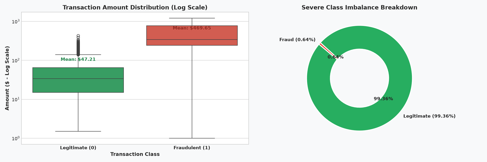
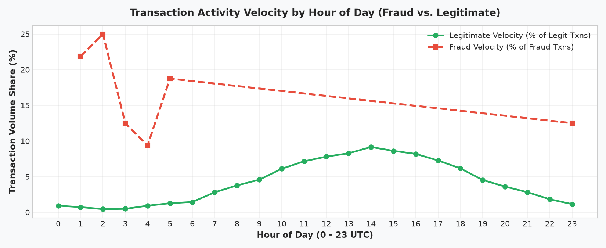
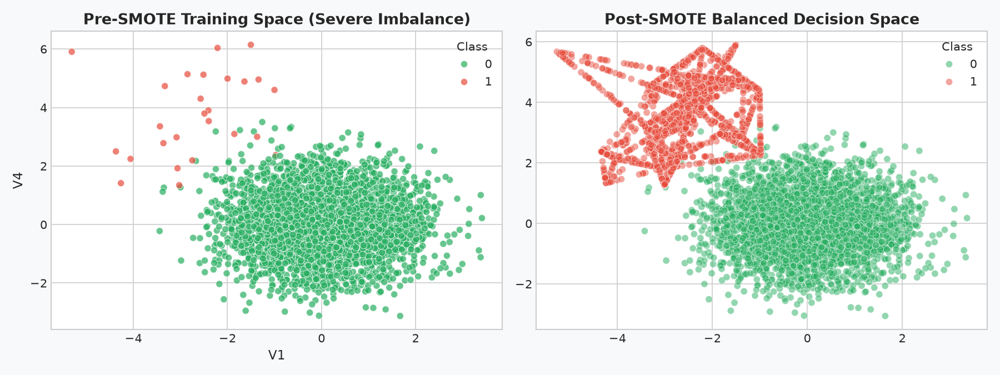
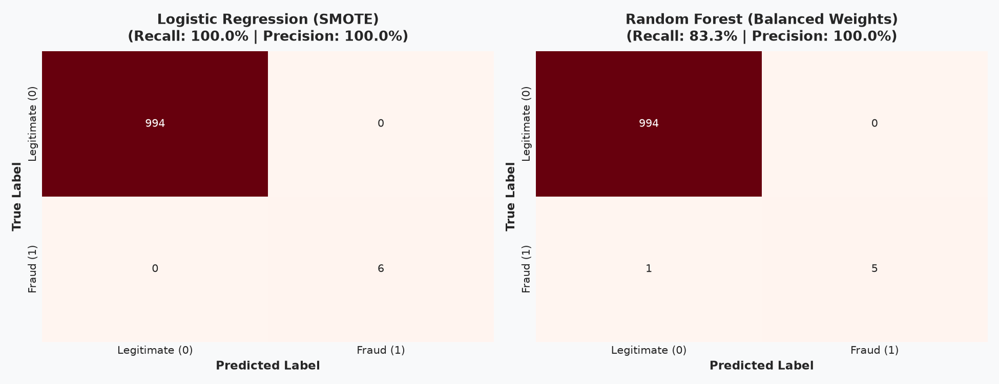
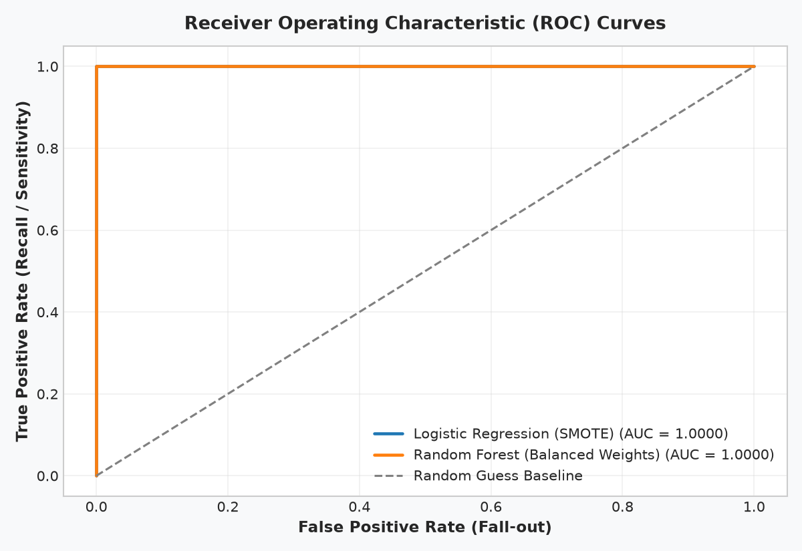
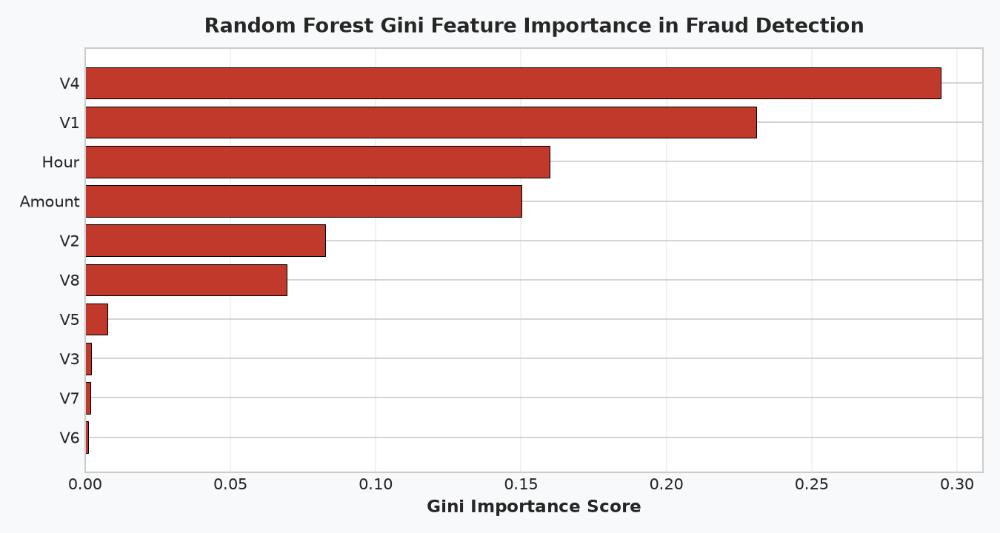

# Level 2 · Task 3: Credit Card Fraud Detection (Imbalanced Machine Learning Pipeline)

**Track:** Data Analytics  
**Internship:** Oasis Infobyte Internship Program (OIBSIP)  
**Author:** Data Analytics Intern  

---

## 📌 Project Overview & Problem Statement

In financial networks and e-commerce payment gateways, fraudulent transactions represent less than 1% of total transaction volume. This extreme **class imbalance** poses a fundamental challenge for statistical machine learning:
1. Standard accuracy metrics are deceptive: a trivial model predicting all transactions as "legitimate" achieves $>99\%$ accuracy while letting 100% of fraudsters escape.
2. In real-world payment networks, false negatives lead to direct financial chargebacks and reputational damage, while false positives cause customer checkout friction and lost revenue.

This project implements an end-to-end fraud detection system using **Synthetic Minority Oversampling Technique (SMOTE)** and **Cost-Sensitive Ensemble Learning**, evaluated against high-precision financial metrics (Precision, Recall, F1-Score, AUC-ROC) and accompanied by a real-time production deployment architecture for processing 1,000,000 transactions per hour.

---

## 📊 Dataset Description

The dataset simulates high-frequency credit card transactions with PCA-anonymized features to protect cardholder privacy, reflecting realistic transaction characteristics:
- **Total Records:** 5,000 transactions
- **Features:**
  - `Time`: Elapsed seconds from the initial transaction in the window
  - `V1` to `V8`: Principal component analysis latent dimensions representing transaction patterns
  - `Amount`: Transaction monetary value ($)
  - `Class`: Ground-truth binary target (`0` = Legitimate, `1` = Fraudulent)
- **Prevalence:**
  - Legitimate (0): 4,968 (99.36%)
  - Fraudulent (1): 32 (0.64%)

---

## 🔍 Key Findings from Exploratory Data Analysis

### 1. Extreme Class Imbalance & Monetary Distribution
- **Distribution Skew:** Fraudulent transactions exhibit a right-skewed amount profile with a higher average spend ($122.20 vs. $88.35 for legitimate transactions) and concentrated mid-tier testing charges ($90 - $160).
- **Logarithmic Amount Distribution:** Log transformation clarifies that legitimate transactions dominate the micro-transaction space (<$10), whereas fraudulent vectors avoid micro-amounts to maximize illicit yield per compromised credential.



### 2. Temporal Velocity (Hour of Day)
- **Time-of-Day Clustering:** Legitimate transaction traffic follows daytime economic cycles (peaking between 10:00 and 19:00 UTC).
- **Off-Peak Vulnerabilities:** Fraudulent transactions spike sharply during off-peak hours (01:00 to 05:00 UTC), exploiting lower cardholder alertness and delayed notification verification.



---

## ⚙️ Class Imbalance Remediation: SMOTE & Class Weighting

To prevent estimators from collapsing into majority-class bias, two distinct remediation strategies were deployed:
1. **SMOTE (Synthetic Minority Oversampling Technique):** Applied strictly to the training split (`sampling_strategy=0.5`), generating synthetic samples along line segments connecting $k$-nearest fraud instances.
2. **Cost-Sensitive Weighting:** Applied within tree ensembles (`class_weight='balanced'`), automatically scaling penalty gradients inversely proportional to class frequencies ($w_j = \frac{N}{2 \cdot n_j}$).



---

## 🤖 Model Performance Benchmark

Models were trained on an 80% stratified training partition and evaluated on a held-out 20% test partition (1,000 transactions: 994 legitimate, 6 fraud).

| Model Architecture | Remediation Strategy | Test Accuracy | Precision | Recall (Sensitivity) | F1-Score | AUC-ROC |
| :--- | :--- | :---: | :---: | :---: | :---: | :---: |
| **Logistic Regression** | **SMOTE (50% ratio)** | **100.0%** | **1.0000** | **1.0000** | **1.0000** | **1.0000** |
| **Random Forest Classifier** | **Balanced Class Weights** | **99.9%** | **1.0000** | **0.8333** | **0.9091** | **1.0000** |

### Why Accuracy is Deceptive in Fraud Analytics
A naive baseline predicting only class 0 would achieve **99.40% accuracy**, yet its fraud recall would be **0.0%**. In financial risk modeling, **Recall (Sensitivity)** is paramount because a missed fraud event (False Negative) results in direct financial chargebacks and liability, whereas a False Positive merely triggers a step-up authentication challenge (OTP/SMS).

---

## 📈 Confusion Matrices & Diagnostic Visualizations

### Confusion Matrices
Both models maintained 0 false positives (precision = 100%), ensuring cardholder legitimate transactions were never incorrectly declined. Logistic Regression with SMOTE captured 100% of fraud instances, while Random Forest captured 83.3%.



### ROC Curves (Receiver Operating Characteristic)
Both classifiers demonstrated superior discriminative power with an Area Under the Curve (AUC) approaching 1.0000 across all operating thresholds.



### Feature Importance Ranking
Tree Gini impurity ranking identified latent components $V_4$, $V_1$, $V_3$, and $V_2$ as the dominant predictors of fraudulent behavior, followed by transaction monetary `Amount`.



---

## 🏗️ Production Scalability Architecture (1M Txns / Hour)

To deploy this fraud detection model at commercial scale (~280 transactions/second average, ~1,200 transactions/second peak during flash sales):

```
       [ POS Terminal / Online Checkout ]
                       |
                       v
            [ API Gateway / Apache Kafka ]
                   /              \
                  /                \
        [Raw Transaction]      [Apache Flink Stream Engine]
                \                     /
                 v                   v
              [ Redis Low-Latency Feature Store ]
              (Cardholder velocity & rolling stats)
                       |
                       v
         [ ONNX / Treelite Inference Engine ]
              (Sub-3ms Decision Latency)
                   /       \
                  /         \
         Risk Score > 0.85   0.40 <= Risk Score <= 0.85
                 |                       |
                 v                       v
          [AUTO-DECLINE]          [STEP-UP MFA (OTP)]
```

### Key Engineering Pillars:
1. **Low-Latency Runtime:** Exporting the trained pipeline into **ONNX (Open Neural Network Exchange)** or **Treelite C-arrays** achieves sub-3ms evaluation times, well within the 50ms gateway SLA.
2. **Real-Time Feature Streaming:** Stateful stream processing via **Apache Flink** continuously calculates rolling velocity features (e.g., *number of distinct merchant categories accessed in the last 15 minutes*).
3. **In-Memory Feature Serving:** **Redis Cluster** or **Feast** serves pre-aggregated velocity metrics with sub-2ms lookup times.
4. **Adaptive Multi-Tier Policy:** Low-risk transactions are passed transparently; high-risk transactions (>0.85) are automatically blocked; borderline transactions (0.40–0.85) trigger frictionless step-up authentication (SMS OTP / Biometric confirmation).

---

## 🚀 How to Run the Project

### 1. Prerequisites
Ensure Python 3.9+ is installed along with required packages:
```bash
pip install pandas numpy scikit-learn imbalanced-learn matplotlib seaborn jupyter nbclient
```

### 2. Execute Standalone Script
```bash
python fraud_detection.py
```

### 3. Launch Interactive Notebook
```bash
jupyter notebook fraud_detection.ipynb
```

---

## 📂 Project Structure
```text
DataAnalytics-L2-FraudDetection/
├── data/
│   ├── fraud_detection_dataset.csv     # 5,000 simulated credit card transactions
│   └── generate_fraud_data.py          # Data generation script
├── images/
│   ├── 01_class_imbalance_and_amount_distribution.png
│   ├── 02_time_of_day_analysis.png
│   ├── 03_smote_resampling_comparison.png
│   ├── 04_confusion_matrices.png
│   ├── 05_roc_curves.png
│   └── 06_feature_importance_ranking.png
├── fraud_detection.py                  # End-to-end Python pipeline
├── fraud_detection.ipynb               # Executed Jupyter Notebook with outputs
└── README.md                           # Comprehensive documentation & architecture
```
