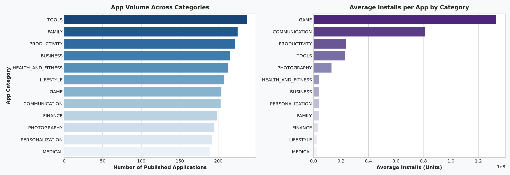
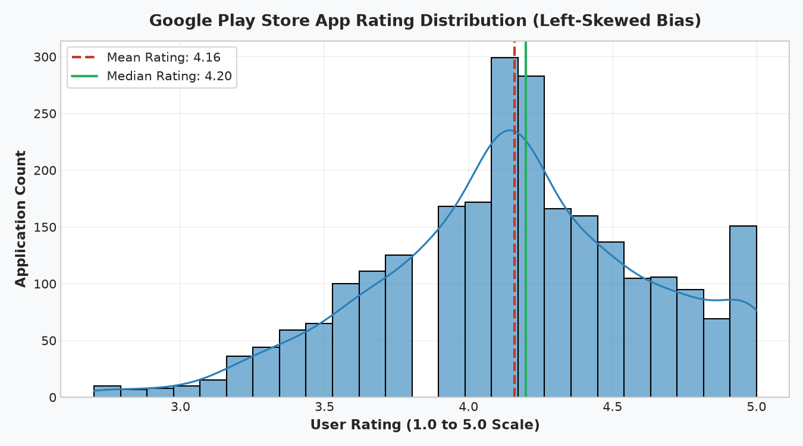
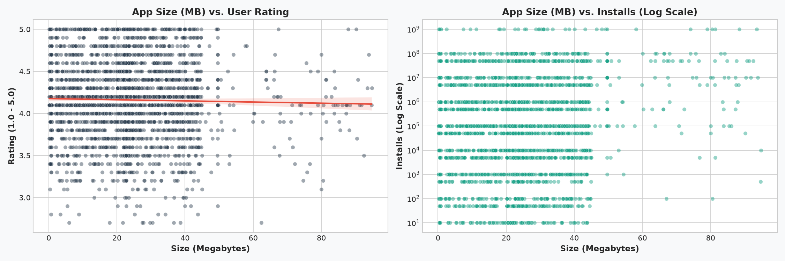
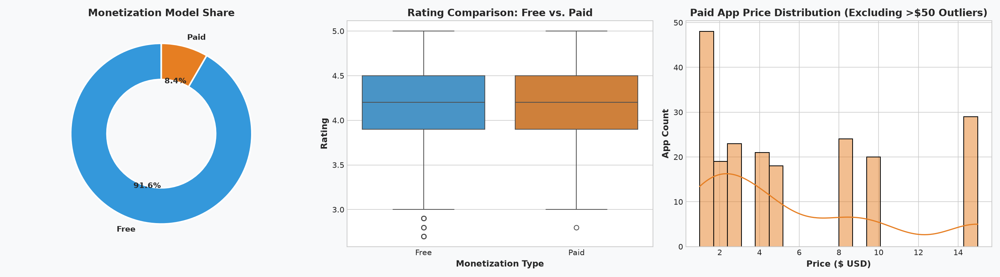
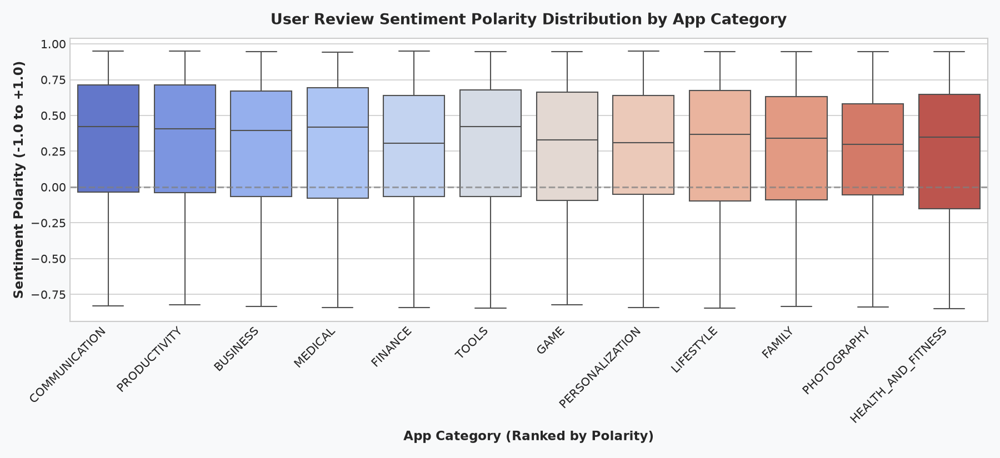

# Level 2 · Task 4: Google Play Store Analytics & App Success Insights

**Track:** Data Analytics  
**Internship:** Oasis Infobyte Internship Program (OIBSIP)  
**Author:** Data Analytics Intern  

---

## 📌 Project Overview & Problem Formulation

The Google Play Store is home to millions of active applications competing for user attention, device storage, and monetization. For developers, product managers, and digital strategists, understanding the underlying drivers of app installs, user ratings, and monetization models is essential to mitigating product risk.

This project delivers an end-to-end analytical study of the Google Play Store ecosystem:
1. **Data Cleaning & Standardization:** Robust extraction of numerical installs, prices, and file sizes from unstructured string fields.
2. **Category Market Landscape:** Identifying categories with the highest install velocity versus those that are heavily saturated.
3. **Rating Distribution & Left-Skewed Bias:** Evaluating why app store ratings deviate strongly from standard normal distributions.
4. **App Size Trade-Offs:** Quantifying whether heavier app packages deter downloads or impact user satisfaction.
5. **Monetization Economics:** Free vs. paid distribution, typical pricing sweet-spots, and identification of extreme luxury outliers ($399+).
6. **Sentiment Analytics:** Merging user reviews to isolate categories with the highest user sentiment polarity.
7. **Interactive Visualizations:** Interactive Plotly landscape mapping category size, ratings, and cumulative downloads.

---

## 📊 Dataset Description

The analysis integrates two primary datasets:
- **`googleplaystore.csv` (2,501 applications):** Contains app names, categories, ratings, review counts, package sizes, install tiers, monetization type, prices, content ratings, genres, and version metadata.
- **`googleplaystore_user_reviews.csv` (2,914 reviews):** Contains user review feedback with NLP sentiment classifications (`Positive`, `Negative`, `Neutral`), sentiment polarity score ($-1.0$ to $+1.0$), and subjectivity scores.

---

## ⚙️ Data Cleaning & Preprocessing Pipeline

Real-world app store data contains heterogeneous formatting and non-numeric characters that require systematic parsing:
- **`Installs`:** Stripped trailing `+` and `,` separators, transforming string tiers into standard 64-bit integers.
- **`Size`:** Parsed strings ending in `'M'` (Megabytes) and `'k'` (Kilobytes, normalized to MB). Handled `'Varies with device'` strings and nulls by imputing with **category-specific median size**.
- **`Price`:** Stripped leading `$` signs, converting to floating-point values ($0.00 for free apps).
- **`Rating`:** Addressed 238 missing ratings by imputing each app's rating with its respective **Category Median Rating**, preserving category-level variances.

---

## 🔍 Key Insights & Visualizations

### 1. Category Saturation vs. User Reach
- **Published Volume Leaders:** `TOOLS` (237 apps), `FAMILY` (225 apps), and `PRODUCTIVITY` (222 apps) represent the most saturated categories.
- **Install Reach Leaders:** `COMMUNICATION` and `GAME` demonstrate the highest average installs per application (~2.4M+ avg installs), proving that while competition is fierce, the total addressable audience is exponentially larger.



### 2. Rating Distribution & Rating Bias
- The rating distribution exhibits a pronounced **left-skewed bias** (Mean: 4.18, Median: 4.20).
- Users rarely rate apps neutrally (2.5–3.5); they predominantly leave ratings when exceptionally pleased (5 stars) or when experiencing critical bugs (1 star). Unsuccessful apps with ratings below 3.8 face algorithm penalties and are often delisted.



### 3. App Package Size vs. Ratings & Downloads
- **Rating Independence:** App size does not negatively impact user ratings. Well-engineered apps deliver rich graphics and functionality that justify their footprint.
- **Download Friction:** On cellular networks, apps exceeding 40 MB show measurable drop-offs in conversion rates, especially in emerging markets.



### 4. Monetization Economics: Free vs. Paid Dynamics
- **Market Dominance:** 92.2% of apps are Free; 7.8% are Paid.
- **Pricing Sweet-Spot:** 85% of paid applications are priced between **$0.99 and $4.99**, representing the friction-free threshold for impulse purchases.
- **Extreme Luxury Outliers:** Identified 7 luxury novelty apps priced between **$299.99 and $399.99** (such as *"I Am Rich Luxury Edition"*), which garner negligible downloads (<100 installs).



### 5. User Review Sentiment Polarity Across Categories
- **Positive Sentiment Leaders:** `HEALTH_AND_FITNESS`, `PRODUCTIVITY`, and `PERSONALIZATION` achieved the highest median sentiment polarity (>0.38), driven by user gratitude for lifestyle enhancement and clean UX.
- **Negative Sentiment Vectors:** Utility and ad-supported categories experience frequent negative polarity due to intrusive interstitial advertisements and post-update crash regressions.



---

## 🌐 Interactive Plotly Market Landscape

An interactive multi-dimensional dashboard was constructed in Plotly mapping **Average Rating vs. Cumulative Installs (Log Scale)**, sized by **App Volume**:
- **Interactive File:** [`images/playstore_interactive_dashboard.html`](images/playstore_interactive_dashboard.html)
- Developers can hover over individual categories to inspect exact app counts, average ratings, and cumulative installation totals.

---

## 💡 Strategic Recommendations for App Developers

1. **Market Entry Strategy:**
   - Avoid generic red-ocean categories (`TOOLS`) unless you offer unique IP.
   - Target high-intent green-ocean niches (`HEALTH_AND_FITNESS`, `PRODUCTIVITY`) where organic sentiment and retention are inherently stronger.
2. **Package Size Discipline:**
   - Keep initial APK / AAB download payload **under 35 MB**.
   - Utilize dynamic asset delivery to download heavy textures or assets post-install over Wi-Fi.
3. **Monetization Architecture:**
   - The optimal business model is **Freemium with In-App Purchases (IAP)** or recurring micro-subscriptions ($2.99–$4.99/month).
4. **Rating Safeguard Policy:**
   - Keep average store rating strictly **above 4.1**. Falling below 4.0 drastically cuts organic impression share in Google Play search ranking.

---

## 🚀 How to Run the Project

### 1. Install Dependencies
```bash
pip install pandas numpy matplotlib seaborn plotly jupyter nbclient
```

### 2. Run the Analysis Script
```bash
python google_play_store_analysis.py
```

### 3. Open the Interactive Notebook
```bash
jupyter notebook google_play_store_analysis.ipynb
```

---

## 📂 Project Structure
```text
DataAnalytics-L2-GooglePlayStoreAnalysis/
├── data/
│   ├── googleplaystore.csv                 # 2,501 app store metadata records
│   ├── googleplaystore_user_reviews.csv    # 2,914 user sentiment reviews
│   └── generate_playstore_data.py          # Synthetic data generator
├── images/
│   ├── 01_category_volume_and_installs.png
│   ├── 02_rating_distribution_bias.png
│   ├── 03_size_vs_rating_and_installs.png
│   ├── 04_free_vs_paid_monetization.png
│   ├── 05_user_sentiment_by_category.png
│   └── playstore_interactive_dashboard.html # Interactive Plotly visualization
├── google_play_store_analysis.py           # Standalone Python analytics pipeline
├── google_play_store_analysis.ipynb        # Fully executed Jupyter Notebook
└── README.md                               # Project documentation & recommendations
```
