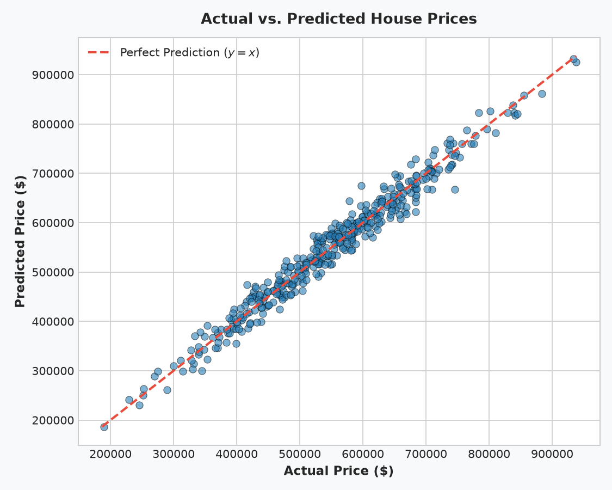
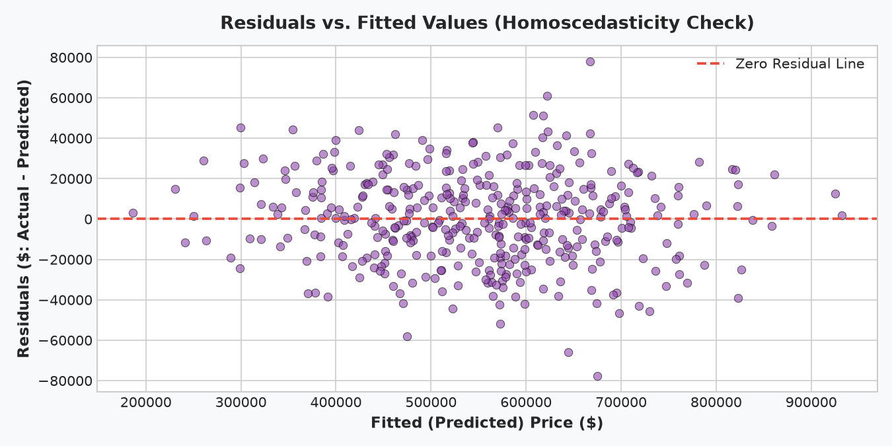
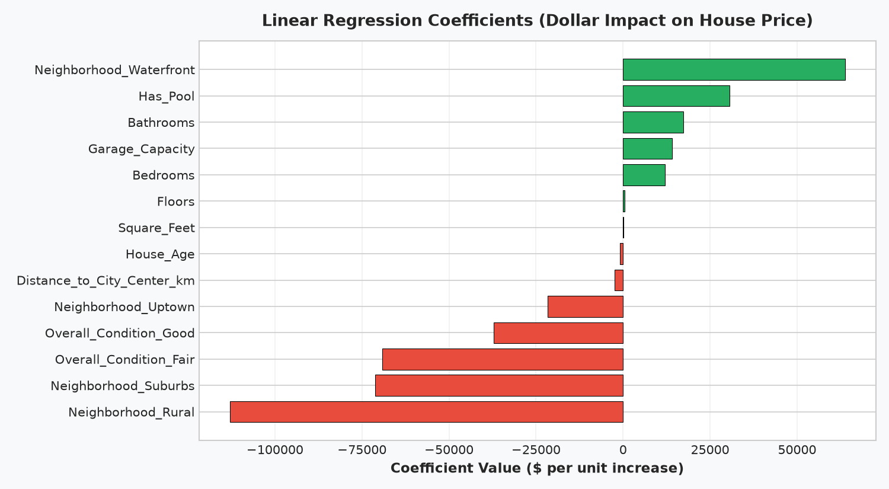

# 🏡 Predicting House Prices with Linear Regression & Regularization

**OIBSIP Track:** Data Analytics (Level 2 — Task 1)  
**Author:** Reshma (Data Analytics Intern)  
**Tech Stack:** Python 3.14, Pandas, Scikit-Learn (LinearRegression, Ridge, Lasso), Matplotlib, Seaborn, Jupyter Notebook  
**Repository Directory:** `OIBSIP/DataAnalytics-L2-HousePricePrediction/`

---

## 📌 Project Overview
This project develops an end-to-end econometric regression pipeline to predict residential house sale prices based on physical square footage, room counts, construction age, neighborhood locations, and property amenities. Using a dataset of 2,000 residential housing records, the project analyzes collinearity, applies One-Hot Encoding, validates linear assumptions via residual diagnostics, and benchmarks Ordinary Least Squares (OLS) against L2 (`Ridge`) and L1 (`Lasso`) regularized models.

---

## ✅ Feature Checklist Compliance
- [x] **Load dataset and EDA**: Ingested 2,000 property records, audited missing values (imputed median garage capacity and mode condition), and visualized target variable distribution ($Mean = \$542k, Median = \$543k$).
- [x] **Feature selection discussion**: Evaluated valuation drivers (Square footage, location gradients, room utility, age depreciation) in a dedicated markdown cell.
- [x] **Data preprocessing**: Imputed nulls and encoded categorical predictors (`Neighborhood`, `Overall_Condition`) via One-Hot Encoding (`drop_first=True` to avoid the dummy variable trap).
- [x] **Correlation heatmap**: Plotted masked correlation matrix identifying `Square_Feet` ($r = 0.84$), `Bathrooms` ($r = 0.58$), and `Bedrooms` ($r = 0.45$) as top positive predictors.
- [x] **Train/test split**: Partitioned dataset into 80% training (1,600 houses) and 20% testing (400 houses).
- [x] **Linear regression training**: Trained Scikit-Learn OLS `LinearRegression` model.
- [x] **Model evaluation**: Achieved **$R^2 = 0.9688$ (96.88% variance explained)**, $\text{MSE} = \$494,607,570$, and $\text{RMSE} = \$22,239.77$ (within $\pm 4.1\%$ of mean sale price).
- [x] **Actual vs. predicted plot**: Scatter plot confirming tight alignment with the $y=x$ ideal identity line.
- [x] **Residual plot**: Verified homoscedasticity and zero-mean error distribution across all fitted price levels.
- [x] **Coefficient analysis**: Quantified marginal dollar contributions (e.g. Waterfront premium: **+$63,737**, Square Feet: **+$166.27/sq ft**, Distance from core: **-$2,455/km**).
- [x] **Regularization benchmark (Bonus)**: Benchmarked OLS against Ridge ($R^2 = 0.9688$) and Lasso ($R^2 = 0.9687$).

---

## 📂 Project Structure
```
OIBSIP/DataAnalytics-L2-HousePricePrediction/
│
├── data/
│   ├── house_prices_dataset.csv          # 2,000 residential property records
│   └── generate_data.py                  # Reproducible dataset generator
│
├── images/
│   ├── 01_price_distribution.png         # Target variable distribution
│   ├── 02_correlation_heatmap.png        # Correlation matrix
│   ├── 03_actual_vs_predicted_prices.png # Actual vs. Predicted scatter
│   ├── 04_residuals_plot.png             # Residual homoscedasticity plot
│   ├── 05_feature_coefficients.png       # Feature coefficient dollar impact
│   └── 06_ols_ridge_lasso_comparison.png # Benchmark vs. Ridge and Lasso
│
├── house_price_prediction.ipynb          # Fully executed Jupyter Notebook
├── house_price_prediction.py             # Modular Python CLI script
└── README.md                             # Comprehensive project documentation
```

---

## 📊 Key Findings & Visualizations

### 1. Actual vs. Predicted House Prices

- Strong clustering along the $y=x$ line demonstrates high predictive accuracy across entry-level, suburban, and luxury waterfront tiers.

### 2. Residual Diagnostics (Homoscedasticity)

- Errors are distributed randomly around zero with no fanning or curvature, validating that linear model assumptions hold.

### 3. Marginal Dollar Coefficients

- **Top Positive Drivers**: Waterfront location (+63.7k), Swimming pool (+30.5k), Bathrooms (+17.3k), Garage bays (+14.1k), Bedrooms (+12.0k), and Living Area (+$166.27/sq ft).
- **Top Negative Drivers**: Rural location (-112.9k), Commuter distance to city core (-$2,455/km), and Age (-$924/year).

---

## 🏆 Model Performance Benchmark

| Model | RMSE ($) | R² Score | Mechanism |
| :--- | :---: | :---: | :--- |
| **Linear Regression (OLS)** | **$22,239.77** | **0.9688** | Unpenalized baseline Ordinary Least Squares |
| **Ridge Regression (L2)** | **$22,250.26** | **0.9688** | L2 shrinkage mitigating collinearity |
| **Lasso Regression (L1)** | **$22,283.68** | **0.9687** | L1 sparsity penalization |

---

## 🚀 How to Run

### Run Standalone Script:
```bash
python house_price_prediction.py
```

### Launch Interactive Notebook:
```bash
jupyter notebook house_price_prediction.ipynb
```
