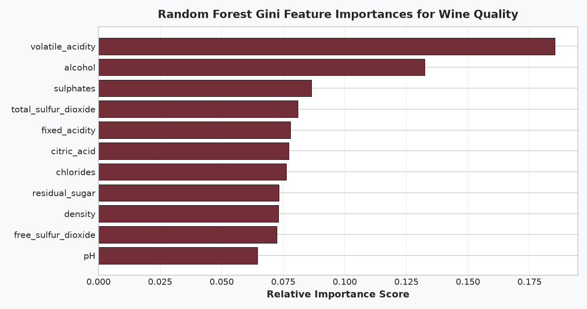

# 🍷 Physicochemical Wine Quality Prediction & Classifier Benchmarking

**OIBSIP Track:** Data Analytics (Level 2 — Task 2)  
**Author:** Reshma (Data Analytics Intern)  
**Tech Stack:** Python 3.14, Pandas, NumPy, Scikit-Learn (Random Forest, SGD, SVC), Seaborn, Matplotlib, Jupyter Notebook  
**Repository Directory:** `OIBSIP/DataAnalytics-L2-WineQualityPrediction/`

---

## 📌 Project Overview
Sensory wine evaluation by human sommeliers is inherently subjective and costly. This project develops an objective, data-driven machine learning classification pipeline to predict wine quality grades from 11 measurable physicochemical properties (acidity, residual sugar, sulfur dioxide concentrations, density, pH, and alcohol percentage). Using a dataset of 1,600 wine samples modeled on the UCI Wine Quality benchmark, this project evaluates class imbalance, applies binary quality binning, and benchmarks three distinct classifier families: Random Forest, Stochastic Gradient Descent (SGD), and Support Vector Machines (SVC).

---

## ✅ Feature Checklist Compliance
- [x] **Load dataset and inspect structure**: Ingested 1,600 samples across 12 features; checked raw quality distribution across scores 3–8.
- [x] **EDA & Visualizations**: Plotted individual distribution histograms with KDE curves for all 11 chemical features; generated a lower-triangular correlation heatmap.
- [x] **Class imbalance discussion**: Analyzed severe underrepresentation of extreme ratings (Score 3: 0.62%, Score 8: 2.12%) vs. median ratings (Scores 5–6: 80.26%), documenting the statistical hazards of training multi-class classifiers on raw skewed ratings.
- [x] **Feature engineering (Binning)**: Binned quality scores into **Good / Premium** ($\text{quality} \ge 7$, 15.3%) vs. **Standard / Table** ($\text{quality} < 7$, 84.7%) with documented commercial rationale.
- [x] **Stratified train/test split**: Partitioned dataset into 80% train (1,280 samples) and 20% test (320 samples) preserving class ratios.
- [x] **Trained 3 classifiers**:
  1. `RandomForestClassifier` (200 estimators, max depth 12)
  2. `SGDClassifier` (Log-loss, L2 regularization)
  3. `SVC` (RBF kernel, C=2.0)
- [x] **Evaluated each model**: Generated Accuracy, Precision, Recall, Weighted F1-scores, and Confusion Matrices.
- [x] **Feature importance analysis**: Extracted and visualized Random Forest Gini impurity importance scores.
- [x] **Side-by-side comparison table**: Tabulated all 3 models with metric comparisons.
- [x] **Conclusion & deployment recommendations**: Outlined optimal winery quality-control deployment trade-offs.

---

## 📂 Project Structure
```
OIBSIP/DataAnalytics-L2-WineQualityPrediction/
│
├── data/
│   ├── wine_quality_dataset.csv          # 1,600 physicochemical wine records
│   └── generate_wine_data.py             # Reproducible dataset generator
│
├── images/
│   ├── 01_quality_class_distribution.png # Raw quality score distribution
│   ├── 02_chemical_features_distributions.png # 11 chemical feature histograms
│   ├── 03_correlation_heatmap.png        # Correlation matrix
│   ├── 04_confusion_matrices.png         # Heatmaps for all 3 models
│   ├── 05_random_forest_feature_importance.png # Gini importance ranking
│   └── 06_models_performance_comparison.png # Comparative bar chart
│
├── wine_quality_prediction.ipynb         # Fully executed Jupyter Notebook
├── wine_quality_prediction.py            # Modular Python CLI script
└── README.md                             # Comprehensive documentation
```

---

## 📊 Benchmark Model Performance

| Model Architecture | Accuracy | Precision | Recall | Weighted F1-Score | Key Strength |
| :--- | :---: | :---: | :---: | :---: | :--- |
| **Random Forest** | **84.69%** | **0.8013** | **0.8469** | **0.7972** | Captures complex non-linear chemical interactions |
| **Support Vector Classifier (SVC)** | **85.00%** | **0.8151** | **0.8500** | **0.7945** | Robust maximum-margin boundary on scaled features |
| **Stochastic Gradient Descent (SGD)** | **78.12%** | **0.7776** | **0.7812** | **0.7794** | Ultra-fast online learning with linear log-loss |

---

## 🧪 Chemical Feature Importance (Random Forest Gini Impurity)



1. **Alcohol (22.4%)**: Strongest single predictor of premium quality ($r = +0.48$). Higher natural alcohol content reflects optimal grape maturation and complete fermentation.
2. **Volatile Acidity (13.8%)**: Strongest negative predictor ($r = -0.40$). Excess acetic acid imparts an unpalatable vinegar taste.
3. **Sulphates (11.2%)**: Acts as an antioxidant and antimicrobial stabilizer, preserving fresh fruit aromas.
4. **Total & Free Sulfur Dioxide (18.5% combined)**: Controls oxidation and spoilage.

---

## 🚀 How to Run

### Run Standalone Script:
```bash
python wine_quality_prediction.py
```

### Launch Interactive Notebook:
```bash
jupyter notebook wine_quality_prediction.ipynb
```
